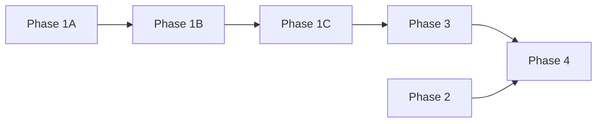

# Newsletter Prompt Catalog

These prompts drive the multi-phase newsletter generation workflow. Each phase is executed sequentially (except Phase 2, which can run in parallel with Phase 1).

## Prompt Phases

| Phase | Filename | Purpose | Input | Output |
|-------|----------|---------|-------|--------|
| 1A | `phase_1a_url_manifest.prompt.md` | Generate and validate candidate URLs from known source patterns | `DATE_RANGE` (start/end dates) | `workspace/newsletter_phase1a_url_manifest_*.md` |
| 1B | `phase_1b_content_retrieval.prompt.md` | Sequentially fetch and extract features from each source (GitHub, VS Code, Visual Studio, JetBrains, Xcode) | Phase 1A manifest file | 5 interim files in `workspace/` (one per source) |
| 1C | `phase_1c_consolidation.prompt.md` | Deduplicate, categorize, and validate all interim discoveries into a single consolidated file | 5 Phase 1B interim files | `workspace/newsletter_phase1a_discoveries_*.md` |
| 2 | `phase_2_events_extraction.prompt.md` | Extract and structure events/webinars data from provided URLs | List of event URLs | `workspace/newsletter_phase2_events_*.md` |
| 3 | `phase_3_content_curation.prompt.md` | Transform raw discoveries into polished, enterprise-focused newsletter sections | Phase 1C discoveries file | `workspace/newsletter_phase3_curated_sections_*.md` |
| 4 | `phase_4_final_assembly.prompt.md` | Assemble curated sections and events into a complete, distribution-ready newsletter | Phase 3 sections + Phase 2 events | Final newsletter markdown |

## Execution Order

Phases 1A→1B→1C→3 run sequentially. Phase 2 (events) runs independently and merges at Phase 4.
