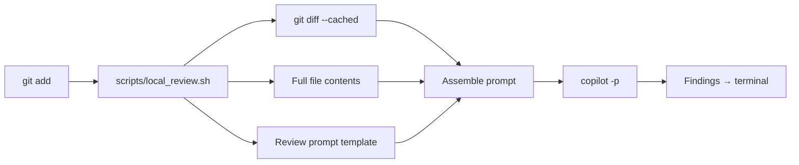

# Review Code Locally

Fast local code review of staged git changes via Copilot CLI. Reviews staged diffs with full file context, applying repo-specific rules from `AGENTS.md` automatically.

## Quick Start

```bash
git add <files>
make review
```

## How It Works



## Workflow / Steps

### Step 1: Stage changes

Stage the files you want reviewed:
```bash
git add <files>
```

### Step 2: Run review

```bash
make review
```

The script:
1. Captures `git diff --cached`
2. Reads full contents of each changed file (up to 500 lines per file)
3. Substitutes diff + file context into the review prompt template
4. Runs `copilot -p "<prompt>" --no-color -s`
5. Prints findings to stdout

### Step 3: Act on findings

Review the severity-tagged findings and fix as needed. Re-stage and re-run.

## Review Prompt

The review prompt is stored at `references/review-prompt.md` within this skill directory. It is **generic** — it works in any repo. Repo-specific rules (deletion discipline, governed paths, artifact cleanliness, etc.) are picked up automatically from `AGENTS.md`, which Copilot CLI loads by default.

The prompt covers:
- **Correctness** — bugs, security, dead code, error handling
- **Cross-File Consistency** — undefined terms, broken references, heading hierarchy
- **Language-Specific Quality** — shell, Python, YAML, Markdown
- **Style** — only when it meaningfully hurts readability

## Output Format

Findings use severity levels: `CRITICAL`, `HIGH`, `MEDIUM`, `LOW`, `NIT`.

Each finding includes file path, line range, description, and suggested fix. Ends with a one-line summary count.

## Known Limitations

- **ARG_MAX**: Prompt is passed as a CLI argument (`copilot -p`). Capped at 500KB to leave headroom for macOS ARG_MAX (~1MB including env).
- **File context reads working tree**: File contents come from the working tree, not the staged index.
- **Large files skipped**: Files over 500 lines are excluded from context to avoid prompt bloat.
- **Placeholder collision**: If a diff contains the literal strings `{{DIFF}}` or `{{FILE_CONTEXT}}`, the awk substitution will misfire.

## Done When

- `make review` with nothing staged prints "Nothing staged" and exits 1
- `make review` with staged changes prints severity-tagged findings to stdout
- Repo-specific rules surface via auto-loaded `AGENTS.md`
- Review completes in under 30 seconds for typical diffs (<500 lines)

## Integration / Invoked By

- Manual invocation via `make review`
- Can be integrated into pre-commit hooks
- Referenced by `AGENTS.md` Testing Workflow section
