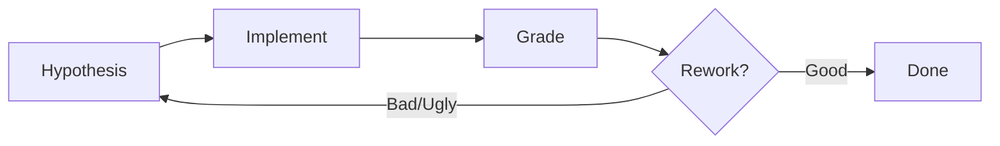

# HIGR Prompt Testing

Test prompt and skill changes systematically with Hypothesis-Implement-Grade-Rework cycles. Every modification requires testable predictions and evidence-based grading against benchmark data.

## Quick Start

1. Write testable hypotheses before editing any prompt or skill
2. Implement the change (delete superseded content)
3. Run against benchmark inputs, compare to known-good output
4. Grade each hypothesis: Good / Bad / Ugly
5. Rework if needed; record results in `workspace/higr_log.md`

## When to Use

- Modifying phase prompts (`.github/prompts/phase_*.prompt.md`)
- Updating skill SKILL.md or references/
- Changing agent definition (`.github/agents/customer_newsletter.agent.md`)
- Changing copilot-instructions.md
- Any change that affects newsletter output quality

## HIGR Cycle



### Step 1: Hypothesis (Pre-Implementation)

Before editing any prompt or skill, write testable predictions:

| Hypothesis ID | Change | Expected Effect | Testable Criteria |
|---------------|--------|-----------------|-------------------|
| H1 | [specific change] | [expected output difference] | [how to verify] |

**Hypothesis Requirements:**
- **Specific** — Not "newsletter will be better"
- **Observable** — Can see the difference in output
- **Falsifiable** — Possible to determine if wrong

**Example Good Hypotheses:**

| ID | Change | Expected Effect | Criteria |
|----|--------|-----------------|----------|
| H1 | Add SOURCES.yaml reading to url-manifest | URL count increases, covers all kb/ sources | URL count within 20% of benchmark, 0 false URLs |
| H2 | Extract selection criteria to skill reference | Curation quality matches Dec 2025 benchmark | ≥70% item overlap with benchmark curated sections |
| H3 | Add IDE parity grouping to content-format-spec | IDE updates grouped correctly | VS Code/Visual Studio/JetBrains in single section |

### Step 2: Implement

Make the change. Delete superseded content immediately — no parallel implementations.

**Rules:**
- No `_v2`, `_new`, `_enhanced` variants
- No backward compatibility code
- Replace existing instructions directly

### Step 3: Grade (Post-Implementation)

Run against benchmark data and grade each hypothesis:

| Hypothesis ID | Outcome | Grade | Evidence |
|---------------|---------|-------|----------|
| H1 | Met | Good | "URL count: 72 (benchmark: 68)" |
| H2 | Partially Met | Bad | "Only 50% overlap vs target 70%" |
| H3 | Unexpected | Ugly | "Grouping present but wrong order" |

**Grade Definitions:**

| Grade | Meaning | Action |
|-------|---------|--------|
| **Good** | Hypothesis confirmed, output matches benchmark | Accept change, proceed to next skill |
| **Bad** | Hypothesis not met, output doesn't match | Rework: adjust skill/prompt, re-test |
| **Ugly** | Major unexpected deviation | Evaluate: may need skill redesign |

### Step 4: Rework (If Needed)

For each Bad or Ugly outcome:

| Outcome | Action |
|---------|--------|
| Bad — output degraded | Fix and re-test |
| Ugly — harmful surprise | Revert or fix |
| Ugly — beneficial surprise | Document and accept |
| Ugly — ambiguous | Halt and reassess |

## Benchmark Testing

### Primary Benchmark: December 2025 Cycle

Known-good intermediates for each pipeline phase:

| Phase | Skill | Known-Good Benchmark File |
|-------|-------|--------------------------|
| 1A | url-manifest | `workspace/archived/newsletter_phase1a_url_manifest_2025-10-06_to_2025-12-02.md` |
| 1B | content-retrieval | `workspace/archived/newsletter_phase1b_interim_*_2025-10-06_to_2025-12-02.md` (5 files) |
| 1C | content-consolidation | `workspace/archived/newsletter_phase1a_discoveries_2025-10-06_to_2025-12-02.md` |
| 2 | events-extraction | `workspace/archived/newsletter_phase2_events_2025-12-02.md` |
| 3 | content-curation | `workspace/archived/newsletter_phase3_curated_sections_2025-12-02.md` |
| 4 | newsletter-assembly | `archive/2025/December.md` (gold standard) |

### Testing Procedure

1. Invoke the skill with its benchmark input (DATE_RANGE or known-good upstream output)
2. Save output to `workspace/`
3. Compare against the known-good benchmark file listed above
4. Grade using the comparison dimensions for that skill (see TRAINING_RUNBOOK.md)

### Comparison Dimensions by Phase

| Phase | Key Dimensions |
|-------|----------------|
| 1A | URL count (within 20%), source coverage (all 5), false URLs (0) |
| 1B | File count (5), extraction format, item counts |
| 1C | Item count (30-50), dedup (0 duplicates), enterprise filter |
| 2 | Table format, canonical categories, date-only for virtual |
| 3 | Item count (15-20), GA/PREVIEW labels, section structure |
| 4 | Mandatory sections present, section order, tone, link format |

### Secondary Benchmarks (Regression Testing)

After changes stabilize, test against additional cycles:

| Cycle | Gold Standard | Best For |
|-------|---------------|----------|
| 2025-08 August | `archive/2025/August.md` | Moderate complexity |
| 2025-06 June | `archive/2025/June.md` | Different content period |

## HIGR Log

Record all HIGR cycles in `workspace/higr_log.md`:

```markdown
### HIGR: [Skill] — [Issue] — [Date]

**Hypothesis:** [What should change and why]
**Implement:** [What was changed, file + section]
**Grade:** [Good/Bad/Ugly] — [Evidence]
**Rework:** [If Bad: what was tried next]
```

## Anti-Patterns

| Anti-Pattern | Problem | Fix |
|--------------|---------|-----|
| Skipping hypotheses | Can't verify improvement | Always write H1+ before editing |
| Testing without benchmark | No quality baseline | Always compare to known-good |
| "Looks better" grading | Not evidence-based | Cite specific dimension + metric |
| Keeping old code | Parallel implementations | Delete superseded content |
| Batch-testing all skills | Can't isolate failures | Test one skill at a time |

## Done When

- Hypotheses written (testable, specific, observable)
- Change implemented (old content deleted)
- Benchmark test executed against known-good intermediate
- Each hypothesis graded: Good / Bad / Ugly
- HIGR log updated in `workspace/higr_log.md`
