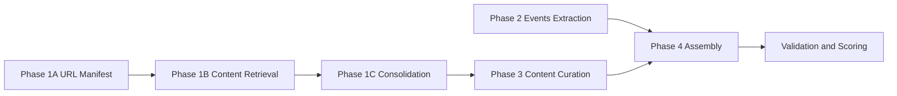
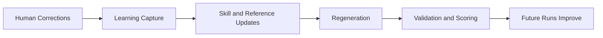

# Architecture

## End-to-End Pipeline

## Self-Learning Propagation

## Interfaces and Artifacts

- Config: `config/profile.yaml`
- Agent entrypoint: `.github/agents/customer_newsletter.agent.md`
- Phase skills: `.github/skills/*/SKILL.md`
- Phase prompts: `.github/prompts/phase_*.prompt.md`
- Output sample: `output/2026-02_february_newsletter.md`
