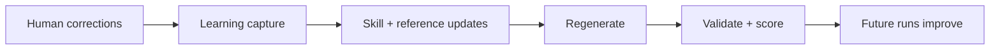

# Architecture

## End-to-End Pipeline

```mermaid
flowchart LR
  A["Phase 1A URL Manifest"] --> B["Phase 1B Content Retrieval"]
  B --> C["Phase 1C Consolidation"]
  C --> N["Phase 1.5 Curator Notes (optional)"]
  N --> D["Phase 2 Event Sources"]
  D --> E["Phase 2 Events"]
  E --> F["Phase 3 Content Curation"]
  F --> G["Phase 4 Assembly"]
  G --> H["Phase 4.5 Polishing"]
  H --> I["Validation + Scoring"]
```

## Self-Learning Propagation

## Interfaces and Artifacts

- Agent entrypoint: `.github/agents/customer_newsletter.agent.md`
- Phase skills: `.github/skills/*/SKILL.md`
- Phase prompts: `.github/prompts/*.prompt.md`
- Fresh-cycle prep: `tools/prepare_newsletter_cycle.sh`
- Strict validation: `tools/validate_pipeline_strict.sh`
- Deterministic event sources:
  - `kb/EVENT_SOURCES.yaml`
  - `tools/extract_event_sources.py`
- Output sample: `output/2026-02_february_newsletter.md`
