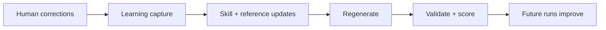
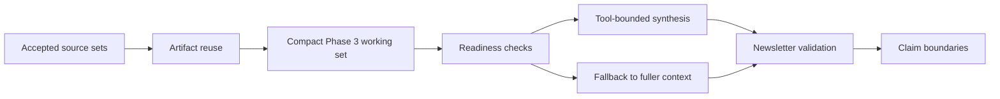

# Architecture

## End-to-End Pipeline

```mermaid
flowchart LR
  A["Phase 1A URL Manifest"] --> B["Phase 1B Content Retrieval"]
  B --> C["Phase 1C Consolidation"]
  C --> N["Phase 1.5 Curator Notes (optional)"]
  N --> D["Phase 2 Event Sources"]
  D --> E["Phase 2 Events"]
  E --> F["Phase 3 Content Curation"]
  F --> G["Phase 4 Assembly"]
  G --> H["Phase 4.5 Polishing + Deprecation Consolidation"]
  H --> I["Phase 4.6 Video Matching (optional)"]
  I --> J["Validation + Scoring"]
  J --> K["Phase 5 Editorial Review"]
```

## Self-Learning Propagation

```mermaid
flowchart LR
  A["Human corrections"] --> B["Learning capture"]
  B --> C["Skill + reference updates"]
  C --> D["Regenerate"]
  D --> E["Validate + score"]
  E --> F["Future runs improve"]
```

## Interfaces and Artifacts

- Agent entrypoint: `.github/agents/customer_newsletter.agent.md`
- Phase skills: `.github/skills/*/SKILL.md`
- Phase prompts: `.github/prompts/*.prompt.md`
- Fresh-cycle prep: `tools/prepare_newsletter_cycle.sh`
- Strict validation: `tools/validate_pipeline_strict.sh`
- Production prompt rendering: `tools/render_product_run_prompt.sh`
- Newsletter validation: `.github/skills/newsletter-validation/scripts/validate_newsletter.sh`
- Deterministic event sources:
  - `kb/EVENT_SOURCES.yaml`
  - `tools/extract_event_sources.py`
- Output sample: `output/2026-02_february_newsletter.md`

## Cost-Aware Architecture

The May 2026 update makes cost behavior part of the workflow architecture:

```mermaid
flowchart LR
  A[Accepted source sets] --> B[Artifact reuse]
  B --> C[Compact Phase 3 working set]
  C --> D[Readiness checks]
  D --> E[Tool-bounded synthesis]
  D --> F[Fallback to fuller context]
  E --> G[Newsletter validation]
  F --> G
  G --> H[Claim boundaries]
```

The important architecture rule is that optimization and quality are coupled. A route is not accepted because it uses fewer tokens; it is accepted only when the final newsletter passes validation and the evidence is labeled correctly.

For the concrete file map, see the [May system release notes](https://github.com/briancl2/CustomerNewsletter/blob/main/release_bundle/2026-05_newsletter_cost_optimization/NEWSLETTER_SYSTEM_RELEASE_NOTES.md).
