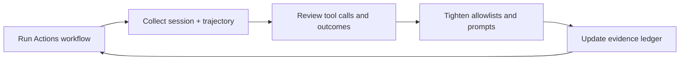

## Purpose

This document defines the operating model for running Copilot CLI in GitHub Actions for this repository. The model treats Actions runs as a first-class surface with evidence artifacts, tight tool boundaries, and repeatable proof workflows.

## Definition: First-Class Citizen

Copilot CLI in Actions is a first-class citizen when it meets all criteria below:

- Runs repo-defined agents, skills, and instructions without special-casing.
- Produces durable evidence artifacts (session export + trajectory) for each run.
- Enforces read-only integrity or PR-only write paths, never direct writes to `main`.
- Leaves the repo clean for read-only workflows (`git diff --exit-code` and `git status --porcelain`).
- Records proof runs and findings in the evidence ledger.

## Proof Workflow Set

| Workflow | Run Type | Intent | Evidence Source |
| --- | --- | --- | --- |
| copilot_cli_actions_proof_dispatch.yml | Manual dispatch | Read-only proof run | [Reports/_copilot_cli_actions_evidence_ledger.md](Reports/_copilot_cli_actions_evidence_ledger.md) |
| copilot_cli_actions_proof_cron.yml | Cron (manual dispatch) | Read-only proof run | [Reports/_copilot_cli_actions_evidence_ledger.md](Reports/_copilot_cli_actions_evidence_ledger.md) |
| copilot_cli_actions_pr_writer.yml | Manual dispatch | PR-writer proof | [Reports/_copilot_cli_actions_evidence_ledger.md](Reports/_copilot_cli_actions_evidence_ledger.md) |

## Evidence Artifacts

- Evidence ledger: [Reports/_copilot_cli_actions_evidence_ledger.md](Reports/_copilot_cli_actions_evidence_ledger.md)
- Curated summaries: [Reports/_copilot_cli_actions_artifacts/](Reports/_copilot_cli_actions_artifacts/)
- Raw artifacts live on the Actions run page (session export + tool-call trajectory).

## Allowlist Strategy

1. **Read-only workflows**
   - Minimal tool surface.
   - Always fail on dirty tree or untracked outputs.
   - Evidence artifacts are required for every run.

2. **PR-writer workflows**
   - Writes only via branch + PR.
   - `git add -u` only; fail on untracked outputs.
   - Allowlist starts broad for proof, then tightens based on evidence.

3. **Tightening loop**
   - Each proof run updates the allowlist based on observed tool calls.
   - Any missing tool call is handled by modifying the allowlist, not by adding fallbacks.

## Failure Modes and Fixes

| Failure Mode | Symptom | Fix |
| --- | --- | --- |
| Tool allowlist too narrow | No tracked changes or missing tool calls | Widen allowlist for proof, then tighten after evidence review |
| Prompt not loaded | Agent ignores instructions | Pass prompt contents directly (avoid tool-filtered prompt load) |
| Untracked outputs | Job fails on `git status --porcelain` | Add explicit cleanup or write to tracked paths only |
| PR-writer does not create diff | No `git diff` | Add explicit shell-based edit and enforce tracked edits |

## R&D Review Loop

## Operating Rules

- New workflows cannot be manually dispatched until merged to `main`.
- Proof runs happen after the scaffold PR merges, in the next PR.
- Evidence artifacts are mandatory for every proof run.
- Remove superseded docs or workflows immediately (no parallel versions).

## Runbook Quickstart

- Trigger manual proof: `gh workflow run copilot_cli_actions_proof_dispatch.yml -r main`
- Trigger cron proof (manual): `gh workflow run copilot_cli_actions_proof_cron.yml -r main`
- Trigger PR-writer proof: `gh workflow run copilot_cli_actions_pr_writer.yml -r main`
- Record results in the ledger: [Reports/_copilot_cli_actions_evidence_ledger.md](Reports/_copilot_cli_actions_evidence_ledger.md)
